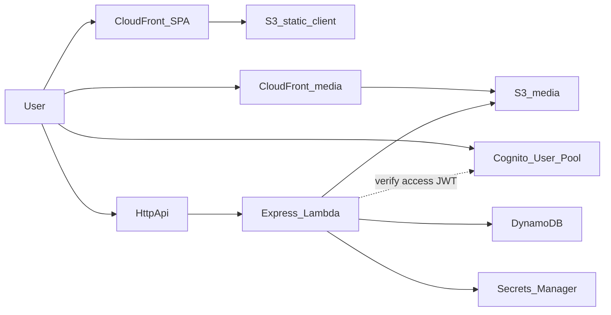

# Share Social Media

Full-stack social media demo: React client + Express API, modernized for TypeScript, characterization tests, GitHub Actions, and low-cost AWS serverless hosting.

## Architecture



| Layer | Tech |
|-------|------|
| Client | React 18, Vite, TypeScript, MUI, Redux |
| Auth | Cognito User Pool (SPA client, no Hosted UI) in AWS; local HS256 JWT when Cognito env is unset |
| API | Express (TypeScript), JWT / Cognito access-token verify, AWS SDK |
| Media | S3 (private) + CloudFront OAC (`uploads/`) |
| Data | DynamoDB (on-demand, single-table) |
| Hosting | S3 + CloudFront (static SPA). Not Vercel — see `vercel.json` + [deployment guide](docs/deployment.md) |
| IaC | AWS CDK — HTTP API, Lambda, DynamoDB, S3 (site + media), CloudFront, Cognito |
| CI/CD | GitHub Actions (OIDC → CDK deploy) |

## Features

- Auth: Cognito SignUp/SignIn + profile completion in AWS; local register/login (HS256) without Cognito env
- Profiles and friends
- Posts with likes, comments, infinite scroll
- File uploads via S3 (served through CloudFront)

## Quick start (local)

```bash
pnpm install
cp server/.env.example server/.env   # fill values
cp client/.env.example client/.env   # VITE_APP_BASE_URL=http://localhost:3000

pnpm --filter server dev
pnpm --filter client dev
```

### Environment

**Server** (`server/.env`):

| Variable | Description |
|----------|-------------|
| `PORT` | API port (default 3000) |
| `TABLE_NAME` | DynamoDB table (default `ShareSocialMedia`) |
| `DYNAMODB_ENDPOINT` | Optional local endpoint; use `memory` for in-process tests |
| `AWS_REGION` | AWS region for DynamoDB |
| `PUBLIC_URL` | Public base URL for stored files |
| `MEDIA_BUCKET` | S3 bucket for uploads |
| `MEDIA_BASE_URL` | Public URL prefix for media (CloudFront domain in AWS) |
| `MEDIA_ENDPOINT` | Optional; `memory` stubs uploads locally |
| `JWT_SECRET` | JWT signing secret |
| `COGNITO_USER_POOL_ID` | Optional; with `COGNITO_CLIENT_ID` enables Cognito access-token verify |
| `COGNITO_CLIENT_ID` | Optional; SPA app client id |

**Client** (`client/.env`):

| Variable | Description |
|----------|-------------|
| `VITE_APP_BASE_URL` | API base URL |
| `VITE_APP_DEFAULT_IMAGE_ID` | Default storage file id for avatars/posts |
| `VITE_COGNITO_USER_POOL_ID` | Optional; with client id + region enables Cognito SPA auth |
| `VITE_COGNITO_CLIENT_ID` | Optional; Cognito app client id |
| `VITE_AWS_REGION` | Optional; Cognito region (required when Cognito vars are set) |
| `VITE_LOCAL_PREVIEW` | Optional; `true` in DEV skips Cognito/API and uses a local preview session |

Local without Cognito: leave `VITE_COGNITO_*` and server `COGNITO_*` unset — client calls `/auth/register` and `/auth/login`, server issues HS256 JWTs.

Local/prod-like with Cognito: set matching Cognito ids on **both** client and server (pool must allow `USER_PASSWORD_AUTH`). Register flow: Cognito SignUp → confirm if needed → InitiateAuth → `POST /auth/profile` with the access token.

## Scripts

| Command | Description |
|---------|-------------|
| `pnpm lint` | ESLint (client + server) |
| `pnpm typecheck` | TypeScript across packages |
| `pnpm test` | Server characterization tests |
| `pnpm build` | Build packages |
| `pnpm --filter server dev` | API with hot reload |
| `pnpm --filter client dev` | Vite dev server |

## Documentation

- [Development guide](docs/development.md) — tooling, tests, conventions
- [Deployment guide](docs/deployment.md) — CDK, secrets, CI/CD, cost notes
- [Infra README](infra/README.md) — CDK stacks overview

## Package layout

```
client/   React SPA
server/   Express API (server.ts local, handler.ts Lambda)
infra/    AWS CDK app
docs/     Development and deployment guides
```

## Backlog (not in this modernization pass)

- OAuth providers, websockets, bookmarks
- UI redesign
- Cognito Hosted UI / social IdPs

## Author

Sebastian Gonzalez — [GitHub](https://github.com/JuanSebastianGB)
