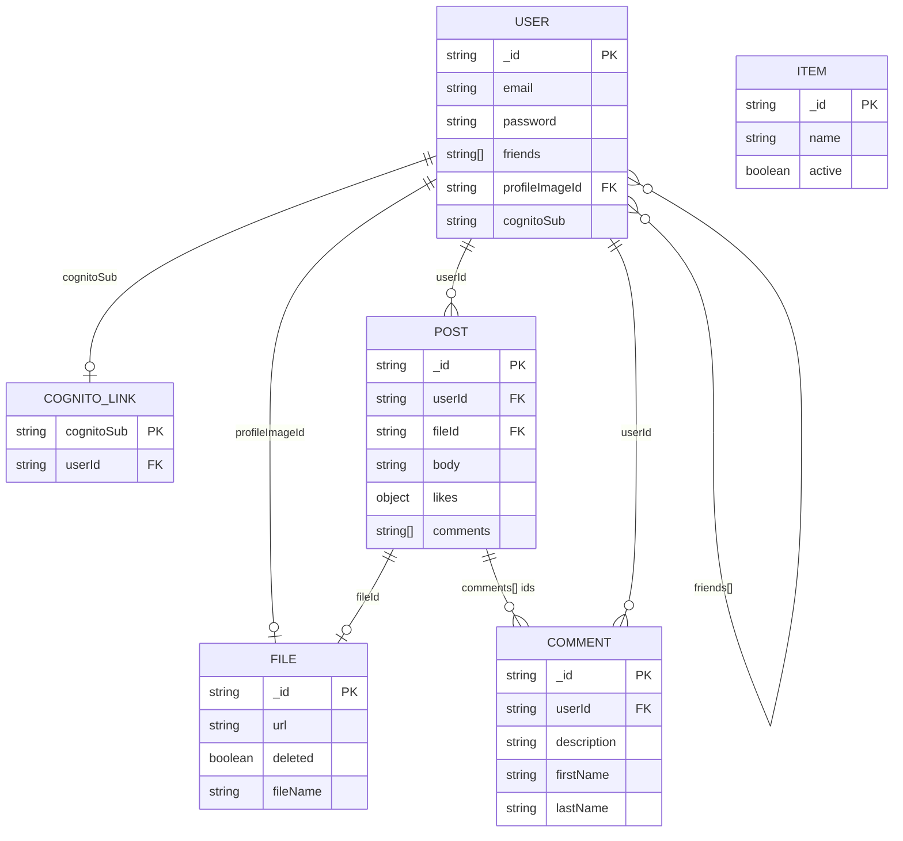

# Data Model Documentation

This document describes the data model for the Share Social Media application: a DynamoDB
single-table design, entity field definitions, relationships, and access patterns.

Canonical key helpers: `server/db/keys.ts`.  
Canonical TypeScript shapes: `server/types/entities.ts`.  
Physical table: CDK `ShareSocialMedia` (PK/SK + GSI1 + GSI2), also creatable via `server/database/dynamo.ts` helpers for local.

## Table overview

| Property | Value |
|----------|-------|
| Table name | `ShareSocialMedia` (override with `TABLE_NAME`) |
| Primary key | `PK` (S), `SK` (S) |
| GSI1 | `GSI1PK` / `GSI1SK` — email lookup + global feed |
| GSI2 | `GSI2PK` / `GSI2SK` — posts by user |
| Billing | On-demand (`PAY_PER_REQUEST`) |
| Id strategy | 24-char hex (`generateId`), MongoId-compatible |

**Not separate tables/entities:** Friend, Like — embedded on User / Post.

## Model Descriptions

### 1. USER

> Status: implemented — Identity BC under `server/modules/identity/` ([CONTEXT.md](../CONTEXT.md), [ADR 0003](./adr/0003-identity-ddd-hexagonal.md))

A social profile stored as one item. Friends are an array of peer user ids (approach B —
embedded on User for this Identity slice; Social graph extract later). Optional
`cognitoSub` when identity is managed by Cognito.

**Keys:**

| Attribute | Value |
|-----------|-------|
| PK | `USER#<_id>` |
| SK | `PROFILE` |
| GSI1PK | `EMAIL#<email lowercase>` |
| GSI1SK | `USER` |
| entityType | `USER` |

**Fields:**

- `_id`: Application user id (string, 24-hex, required)
- `firstName`: Given name (string, optional on type; required by register/profile validators)
- `lastName`: Family name (string, optional on type; required by validators)
- `username`: Optional username (string)
- `password`: bcrypt hash for local auth (string, optional; omitted/undefined for Cognito users)
- `email`: Unique via GSI1 (string, required)
- `age`: Optional number
- `role`: `string` or `string[]` (default `'user'`)
- `friends`: Array of user `_id` strings (default `[]`)
- `location`: String
- `occupation`: String
- `viewedProfile`: Number (demo random on register)
- `impressions`: Number (demo random on register)
- `profileImageId`: FILE `_id` for avatar
- `cognitoSub`: Cognito access-token `sub` when linked
- `createdAt` / `updatedAt`: ISO-8601 strings

**Relationships:**

- USER 1 — * FILE via `profileImageId`
- USER * — * USER via `friends[]` (no join entity)
- USER 1 — * POST via `Post.userId` / GSI2
- USER 0..1 — 1 COGNITO_LINK when Cognito-linked

### 2. COGNITO_LINK

> Status: implemented — Identity BC Cognito link persistence ([ADR 0003](./adr/0003-identity-ddd-hexagonal.md))

Pointer item mapping Cognito `sub` → application user id (GetItem, no GSI required).
Owned by Identity `DynamoUserRepository` alongside the USER item when `cognitoSub` is set.

**Keys:**

| Attribute | Value |
|-----------|-------|
| PK | `COGNITO#` |
| SK | `LINK` |
| entityType | `COGNITO_LINK` |

**Fields:**

- `userId`: Target USER `_id` (string, required)
- `cognitoSub`: Cognito subject (string, required)
- `createdAt`: ISO-8601 string

**Relationships:**

- COGNITO_LINK * — 1 USER (`userId`)

### 3. POST

> Status: implemented

A feed post. Likes are a map of `userId → true`. Comments are an array of COMMENT `_id`s
(denormalized on the post). Media is referenced by `fileId`.

**Keys:**

| Attribute | Value |
|-----------|-------|
| PK | `POST#<_id>` |
| SK | `META` |
| GSI1PK | `FEED` (constant `GSI.FEED`) |
| GSI1SK | `POST#<isoCreatedAt>#<_id>` |
| GSI2PK | `USER#<userId>` |
| GSI2SK | `POST#<isoCreatedAt>#<_id>` |
| entityType | `POST` |

**Fields:**

- `_id`: Post id (24-hex)
- `body`: Text content (string, required)
- `userId`: Author USER `_id` (string, required)
- `fileId`: FILE `_id` (string, optional but required for successful hydration in feed)
- `likes`: `Record<string, boolean>` map (default `{}`)
- `comments`: `string[]` of comment ids (default `[]`)
- `type`: String (default `'file'`)
- `createdAt` / `updatedAt`: ISO-8601

**Hydrated API shape (service layer, not stored):** nested `user` (with `profileImage`) and `file` (`_id`, `url`).

**Relationships:**

- POST * — 1 USER (`userId`)
- POST * — 0..1 FILE (`fileId`)
- POST 1 — * COMMENT via `comments[]` ids (COMMENT items do **not** store `postId`)

### 4. COMMENT

> Status: implemented — Comments BC under `server/modules/comments/` ([CONTEXT.md](../CONTEXT.md), [ADR 0002](./adr/0002-comments-ddd-hexagonal.md))

A comment authored by a user. Association to a post is maintained by appending the comment
id onto `Post.comments` at create time (Comments create-on-post → Feed attach). The COMMENT item itself
has no `postId` attribute.

**Keys:**

| Attribute | Value |
|-----------|-------|
| PK | `COMMENT#<_id>` |
| SK | `META` |
| entityType | `COMMENT` |

**Fields:**

- `_id`: Comment id (24-hex)
- `description`: Body text (string)
- `userId`: Author id (string; set from JWT on create)
- `firstName` / `lastName`: Denormalized author name strings (from request body)
- `createdAt` / `updatedAt`: ISO-8601

**Relationships:**

- COMMENT * — 1 USER (`userId`)
- COMMENT * — * POST inverse via `Post.comments[]` (application-level)

### 5. FILE (storage)

> Status: implemented

Metadata for an uploaded media object. Bytes live in S3 (or memory stub); `url` holds the
public CloudFront/S3/memory URL. Soft delete sets `deleted: true` (reads hide soft-deleted).

**Keys:**

| Attribute | Value |
|-----------|-------|
| PK | `FILE#<_id>` |
| SK | `META` |
| entityType | `FILE` |

**Fields:**

- `_id`: File id (24-hex); default avatar id constant `63cf4d2242c5e33c105a87eb` (`DEFAULT_IMAGE_ID`)
- `fileName` / `filename`: Original name (both may be present for legacy compat)
- `url`: Public URL string
- `deleted`: Boolean (default false)
- `createdAt` / `updatedAt`: ISO-8601

**Relationships:**

- Referenced by USER.`profileImageId` and POST.`fileId`

### 6. ITEM

> Status: implemented

Demo CRUD entity (admin create). Not part of the social feed domain.

**Keys:**

| Attribute | Value |
|-----------|-------|
| PK | `ITEM#<_id>` |
| SK | `META` |
| entityType | `ITEM` |

**Fields:**

- `_id`: Item id (24-hex)
- `name`: String (validator length 5–20)
- `active`: Boolean (default true)
- `createdAt` / `updatedAt`: ISO-8601

**Relationships:** none.

## Access patterns

| Need | Pattern |
|------|---------|
| Get user by id | GetItem `USER#id` / `PROFILE` |
| Get user by email | Query GSI1 `EMAIL#email` + `USER` |
| Get user by Cognito sub | GetItem link then GetItem user |
| List users | **Scan** PK begins `USER#` + SK `PROFILE` (legacy) |
| Global feed post ids | Query GSI1 `FEED` sorted by `GSI1SK` |
| Posts for user | Query GSI2 `USER#userId` |
| Get post / comment / file / item | GetItem on respective PK + `META`/`PROFILE` |
| List comments / items / files | **Scan** with prefix filter (legacy) |

## Entity Relationship Diagram

## Key Design Principles

- **Single-table design:** all entity types share one table; `entityType` and key prefixes discriminate.
- **Embedded social graph:** friends and likes are attributes, not rows — simplifies demo writes, complicates querying “who liked X” at scale.
- **Comment linkage is denormalized:** create writes COMMENT item + updates POST.`comments` (Comments BC + Feed attach); deleting a comment does not automatically repair the post array (verify behavior before assuming cascade). See [ADR 0002](./adr/0002-comments-ddd-hexagonal.md).
- **Identity USER + COGNITO_LINK:** profile and optional Cognito pointer live in the Identity BC (`server/modules/identity/`). See [ADR 0003](./adr/0003-identity-ddd-hexagonal.md) and [CONTEXT.md](../CONTEXT.md).
- **Soft delete for files:** `deleted` flag; hard delete used when removing post media.
- **ISO timestamps** as strings; no DynamoDB TTL configured in app code.
- **Id strategy** remains Mongo-compatible hex for validator compatibility (`isMongoId`).
- **Local vs AWS:** `DYNAMODB_ENDPOINT=memory` uses an in-process client that supports PK/SK + GSI1 + GSI2 patterns.

## Notes

- Scan-based list APIs are **demo-scale legacy** — do not treat them as production access patterns.
- Media URL host may migrate from S3 website-style URLs to CloudFront (`docs/deployment.md`); old rows can break display until rewritten.
- `MONGO_IMAGE_ID` is a deprecated alias of `DEFAULT_IMAGE_ID`.
- Server Swagger schemas may disagree with this model; trust repositories + this document + `api-spec.yml`.
